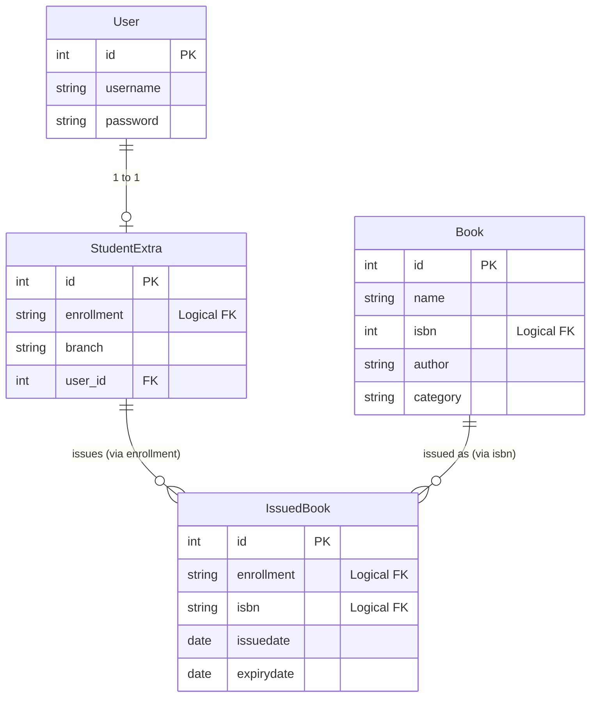

# Library Management System

A Library Management System web application built with Python and Django.

## Features

### Admin Module
- Secure Admin login and signup.
- **Manage Books:** Add new books and view the catalog of all available books.
- **Manage Students:** View a list of all registered students in the system.
- **Issue Books:** Issue books to students using their Enrollment Number and Book ISBN.
- **Track Issued Books:** View the complete record of books currently issued, including issue and expiry dates.

### Student Module
- Secure Student login and signup.
- **View Issued Books:** Students can log in to check which books have been issued to them and track their due dates.

### General Features
- About Us and Contact Us pages.
- Clean User Interface with secure logout functionality.

## Technology Stack
- Python
- Django (3.0.5)
- SQLite3 (Default Database)
- HTML/CSS/JavaScript

## Database Entity-Relationship Diagram



## Setup Instructions

1. **Clone the repository** (if not already cloned)
   ```bash
   git clone https://github.com/Dpjaiswal/librarymanagement.git
   cd librarymanagement
   ```

2. **Create and activate a virtual environment**
   ```bash
   python -m venv venv
   # On Windows:
   .\venv\Scripts\activate
   # On Linux/Mac:
   source venv/bin/activate
   ```

3. **Install the dependencies**
   ```bash
   pip install -r requirements.txt
   ```

4. **Run Database Migrations**
   ```bash
   python manage.py makemigrations
   python manage.py migrate
   ```

5. **Create a Superuser (for Admin access)**
   ```bash
   python manage.py createsuperuser
   ```

6. **Run the local development server**
   ```bash
   python manage.py runserver
   ```
   Open `http://127.0.0.1:8000/` in your browser.
